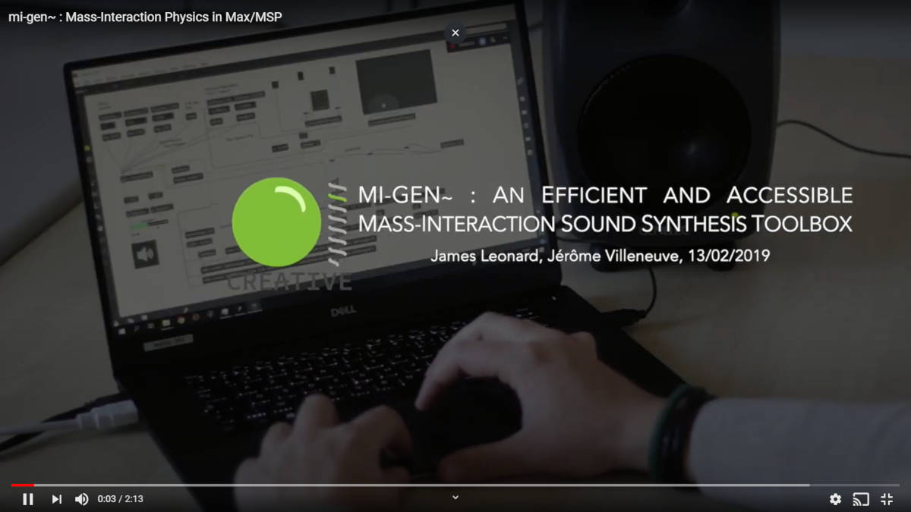
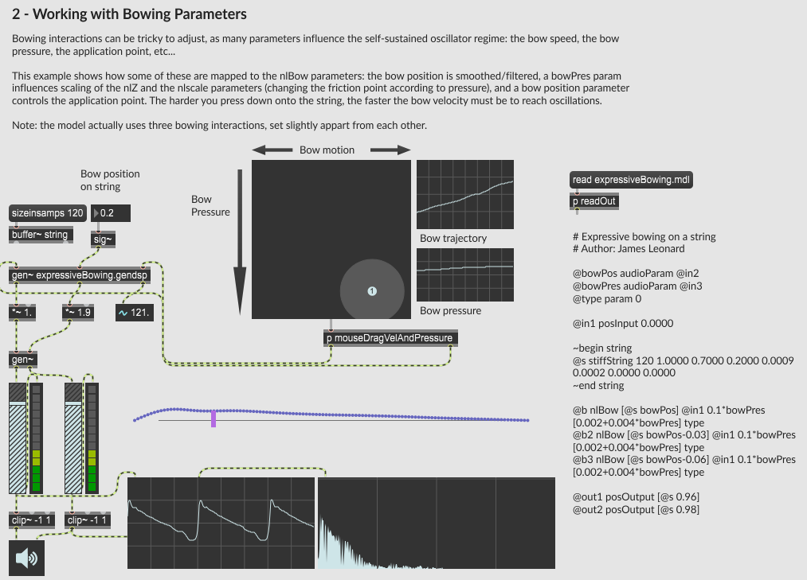

# mi-gen
### *Mass-Interaction Sound Synthesis Toolbox for Max/MSP's gen~*

[](https://youtu.be/ZssBFJa7Jss "Click to watch presentation video")


**mi-gen** is a mass-interaction physical modelling toolbox for the Max/MSP patching environment.
It allows coding and simulating virtual physical objects, modelled as networks of masses and interactions (springs, dampers, conditional contacts, etc.), directly within gen~'s *codebox* system.


## Installation

Clone or download the github repository and place the **mi-gen** folder in the Max/MSP's package folder (in Windows: {path-to-documents}/Max[7/8]/Packages).

## A Quick Introduction

Once you've placed the package in Max's package folder and launched Max, head over to the "extras" tab: you should find an ***mi-gen~/mi-gen~ Intro Patch***. Open the 00 - MI_Introduction and - tadaaaaa - get to know which physical elements compose mi-gen~, what they do and how the library integrates with gen~'s codebox.


*Above: The ***mi-gen~*** introduction patch.*


## Creating Models : MIMS and MIMS4Max

While it's possible to create phyiscal models by writting genexpr code by hand, we can make things much easier by using a model scripting tool, that will generate all the necessary code based on a physical model description: this is where **MIMS** (Mass Interaction Model Scripter) comes in.

A first prototype of MIMS was developped in Python [here](https://github.com/mi-creative/MIMS). However, a much nicer and up-to-date ***MIMS4Max*** tool is now directly integrated into mi-gen~! It relies on Max's new [NodeJS](https://docs.cycling74.com/nodeformax/api/) integration, using Javascript to interpet and compile model descriptions into gen~ code.

In simple terms, first you write a model with a simple syntax on the left, following which it is parsed. If the model syntax is correct, code is generated on the right, allowing you to create a *"[model].gendsp"* object that can be dropped straight into any Max/MSP project. Oh, and as a bonus you can also generate DSP code for the [Faust](https://faust.grame.fr/) environment !

If mi-gen~ is in your Max package location, MIMS4Max should be located in your extras tab under: ***mi-gen~/MIMS4Max/MIMSforMax***.


*Above: The ***MIMS4Max*** model scripting tool, developped with Node4Max*


## Running the examples

The examples are located in the "examples" subfolder. There are several, demonstrating various virtual instruments and interactions (plucked and bowed strings, meshes, polyphonic instruments, etc.). They are always composed of a patch file, a gendsp file containing the model, and generally a .mdl file, corresponding to a model description.

### Tutorial Material

The best way to explore the tutorial examples is through a navigation patch in the extras ***mi-gen~/NavigateTutorials***. You can browse between three tutorial chapters:
* The **oscillator** series, focusing on the harmonic oscillator.
* The **building** series, which progressively introduces various concepts for building models in mi-gen~.
* The **modelling** series, focusing on some more advanced modelling techniques.


*Above: The tutorial navigation patch.*



*Above: A tutorial patch of a bowed string model.*

### The Model Gallery

The ***Model_Gallery*** folder in the examples also contains many patches that you can also explore, play with and tweak around, or use as a base for your own work.


*Above: a mass-interaction string model and associated Max patch (***FrettedString*** example)*


*Above: a mass-interaction rectangular mesh (from the ***Mesh_15by15*** example), rendered using NURBS in Jitter*

## How mass-interaction models are expressed within gen~

Models are created in *codebox* objects (allowing textual coding within the gen~ system) using the ***migen-lib.genexpr*** library, that defines the various physical elements, as well as functions for input/output, etc.

The code for a very basic mass-interaction model implemented with mi-gen~ is shown below:

```C

require("migen-lib");

// Model data structures
Data m_in2(3);
Data gnd(3);
Data m1(3);

// Control Rate Parameters
Param Z(0.0001);
Param K(0.01);
Param M(1.);

History model_init(0);
// Model init phase
if(model_init == 0){
    init_mat(m_in2, 1, 1);
    init_mat(gnd, 0, 0);
    init_mat(m1, 0, 0);
    model_init = 1;
}

// Model computation
update_input_pos(m_in2, in2);
compute_ground(gnd);
compute_mass(m1, M);
compute_contact(m1, m_in2, 0.1, 0, 0);
apply_input_force(m1, in1);
compute_spring_damper(m1, gnd, K, Z);

out1 =  get_pos(m1);

```

The above model creates a harmonic oscillator (a mass connected to a fixed point by a dampened spring) that can be subjected to force impulses via the first inlet of the *codebox* object and can be struck using a contact interaction (with stiffness, damping and threshold distance parameters) by another mass, whose position is controlled by the second inlet.

Each material element in the model (mass, fixed point, etc.) is a represented by a 3-value *Data* array, containing the element's current position, previous position, and sum of forces applied to it by interactions.

The *model_init* flag allows to initialise the model state (initial positions and previous positions - thus resulting initial velocity) during the first step of computation.

## Authors

This project was developped by James Leonard, within the **Digital Arts and Sensory Immersions** research cell at **GIPSA-Lab** (Grenoble, France) with the support of the French Ministry of Culture.

For more information and video tutorials, head over to: www.mi-creative.eu

Read the supporting paper (published at SMC'19): http://www.mi-creative.eu/paper_smc19_gen.html

## License

This project is licensed under the GNU GENERAL PUBLIC LICENSE - see the [LICENSE](LICENSE) file for details

## Acknowledgments

This work implements mass-interaction physical modelling, a concept originally developped at [ACROE](http://www.acroe-ica.org/fr) - and now widely used in sound synthesis, haptic interaction and visual creation.
