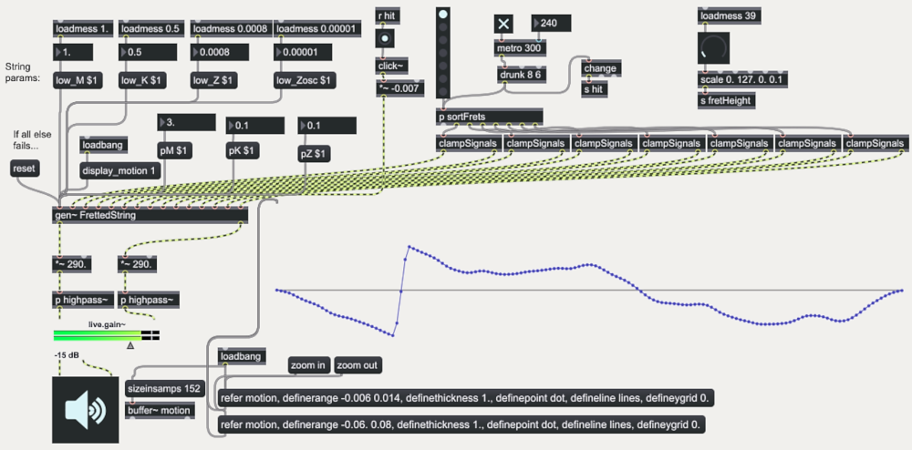
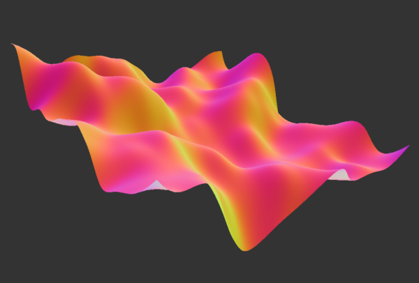

# mi-gen
Mass-Interaction Sound Synthesis Toolbox for Max/MSP's gen~


**mi-gen** is a mass-interaction physical modelling toolbox for the Max/MSP patching environment.
It allows coding and simulating virtual physical objects, modelled as networks of masses and interactions (springs, dampers, conditional contacts, etc.), directly within gen~'s *codebox* system.


## Getting Started

Clone or download the github repository and place the **mi-gen** folder in the Max/MSP's package folder (in Windows: {path-to-documents}/Max[7/8]/Packages).

## The Tutorial Patch

Once you've placed the package in Max's package folder and launched Max, head over to the "extras" tab: you should find an ***mi-gen~ Tutorial Patch***. Open the 00 - MI_Tutorial and - tadaaaaa - get to know which physical elements compose mi-gen~, what they do and how you can use codebox to create models with them !


## Running the examples

The examples are in the "examples" subfolder. There are several, demonstrating various virtual instruments and interactions (plucked and bowed strings, meshes, polyphonic instruments, etc.). They are always composed of a patch file, a gendsp file containing the model, and generally a .mdl file, corresponding to a model description.

Each patch deals with parameters, real-time control and visualisation in its own way, we encourage you to browse through them to see what's possible.




*Above: a mass-interaction string model and associated Max patch (***FrettedString*** example)*



*Above: a mass-interaction rectangular mesh (from the ***Mesh_15by15*** example), rendered using NURBS in Jitter*

## How to write mass-interaction models in gen~

Models are created in *codebox* objects (allowing textual coding within the gen~ system) using the ***migen-lib.genexpr*** library, that defines the various physical elements, as well as functions for input/output, etc.

The code for a very basic mass-interaction model implemented with mi-gen~ is shown below:

```C

require("migen-lib");

// Model data structures
Data m_in2(3);
Data gnd(3);
Data m1(3);

// Control Rate Parameters
Param Z(0.0001);
Param K(0.01);
Param M(1.);

History model_init(0);
// Model init phase
if(model_init == 0){
    init_mat(m_in2, 1, 1);
    init_mat(gnd, 0, 0);
    init_mat(m1, 0, 0);
    model_init = 1;
}

// Model computation
update_input_pos(m_in2, in2);
compute_ground(gnd);
compute_mass(m1, M);
compute_contact(m1, m_in2, 0.1, 0, 0);
apply_input_force(m1, in1);
compute_spring_damper(m1, gnd, K, Z);

out1 =  get_pos(m1);

```

The above model creates a harmonic oscillator (a mass connected to a fixed point by a dampened spring) that can be subjected to force impulses via the first inlet of the *codebox* object and can be struck using a contact interaction (with stiffness, damping and threshold distance parameters) by another mass, whose position is controlled by the second inlet.

Each material element in the model (mass, fixed point, etc.) is a represented by a 3-value *Data* array, containing the element's current position, previous position, and sum of forces applied to it by interactions.

The *model_init* flag allows to initialise the model state (initial positions and previous positions - thus resulting initial velocity) during the first step of computation.

## The MIMS Model Scripter

MIMS is a model scripting tool, built in Python, that can be used to create larger physical models (that would be a pain to code by hand directly in gen~).

It can be found on github at the following address:  [MIMS](https://github.com/mi-creative/MIMS)


## Documentation

Documentation outside of the actual examples and tutorial patches is sparse for now but do not fear - we'll be adding more as we go along!


## Authors

This project was developped by James Leonard.

For more info, see: www.mi-creative.eu

## License

This project is licensed under the GNU GENERAL PUBLIC LICENSE - see the [LICENSE](LICENSE) file for details

## Acknowledgments

This work implements mass-interaction physical modelling, a concept originally developped at ACROE - and now widely used in sound synthesis, haptic interaction and visual creation.
